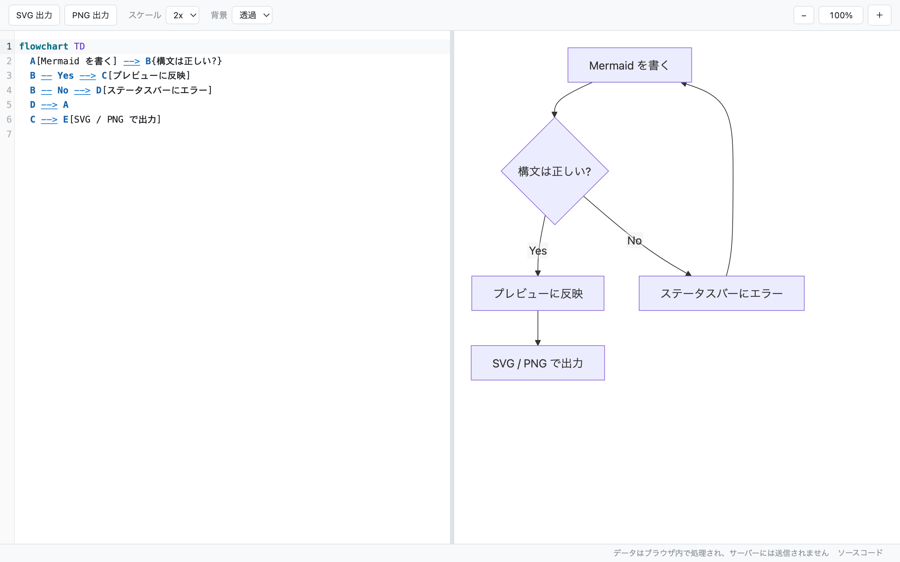

# Mermaid エディタ

Mermaid 形式のテキストを編集し、リアルタイムでプレビューし、PNG / SVG として出力する個人用の Web ツール。
サーバーサイド処理を持たない静的サイトとして動作する。

図の解析・描画・画像変換はすべてブラウザ内で完結し、入力内容がサーバーへ送信されることはない。
保存先も localStorage のみで、外部 CDN にも依存しない。



## 機能

- CodeMirror 6 による Mermaid シンタックスハイライト(行番号、Tab インデント、undo / redo)
- 入力停止 300ms 後にプレビューを更新。構文エラー時は直前の図を保持し、ステータスバーにエラーを表示
- SVG 出力 / PNG 出力(スケール 1x・2x・3x、背景 透過・白)
- 入力停止 1 秒後に localStorage へ自動保存し、次回起動時に復元
- 左右ペインの分割比率をドラッグで変更し、比率を保存
- プレビューのズーム(50%〜200%、ボタンまたは Cmd + スクロール)
- PWA としてインストールでき、オフラインでも全図種を描画できる(後述)
- ステータスバーに作成者と、動作中の版(バージョンとビルド日時)を表示

## セットアップ

Node.js 24.19.0(Active LTS)を前提とする。バージョンは `mise.toml` で固定している。

```bash
mise install
npm install
```

## ローカル起動

```bash
make dev
```

`http://localhost:5173` が開く。

## その他のコマンド

```bash
make preview # ビルドして dist/ を配信(PWA の動作確認用)
make build   # 型チェック + 静的ビルド(dist/)
make test    # ユニットテスト(Vitest)
make fmt     # oxfmt でフォーマット
make lint    # oxlint(型情報を使ったルールを含む)
make check   # フォーマット確認 + lint + 型チェック + テスト
make icons   # SVG 原本から PWA 用の PNG を書き出す(要 rsvg-convert)
make deploy  # ビルドして Cloudflare Workers へデプロイ
```

## PWA

インストールして、オフラインでも使える。設計の背景と決定事項は [docs/pwa-spec.md](docs/pwa-spec.md) にまとめてある。

- **インストール** — 対応ブラウザのアドレスバーからインストールすると、独立したウィンドウで起動する
- **オフライン動作** — mermaid は図種ごとにチャンクを遅延ロードするため、ビルド成果物すべて
  (約 4MB)を初回にキャッシュする。これによりネットワークがなくても全図種を描画できる
- **`.mmd` の関連付け** — デスクトップ版 Chrome / Edge では `.mmd` / `.mermaid` をダブルクリックで開ける
- **共有メニュー** — Android Chrome では共有先として選べる
- **更新** — 新しい版を検知するとステータスバーに「更新があります: 再読み込み」を表示する。
  編集中に勝手にリロードして undo 履歴を壊さないよう、適用はクリック操作に委ねている
- **版の確認** — 更新を適用するまで古い版を掴み続けるため、ステータスバー右側に
  `v0.1.0 (2026-08-18 08:42)` の形式で動作中の版を出す。バージョンはデプロイのたびには
  上がらないので、最新かどうかはビルド日時で見分ける(`vite.config.ts` の `define` で埋め込む)

開いたファイルには書き戻さない。保存先は従来どおり localStorage のみで、
受け取ったテキストで現在の内容を置き換える前に確認する。

Service Worker は本番ビルドでのみ有効になるため、動作確認は `make dev` ではなく `make preview` で行う。

## 品質チェックの自動化

手で lint を回して直す運用にしないため、2 段階で強制する。

- **pre-commit フック** (`.githooks/pre-commit`) — ステージしたファイルを oxfmt で整形して
  コミットに含め、続けて lint・型チェック・テストを実行する。全体で 2 秒程度。
  `npm install` の `prepare` スクリプトで自動的に有効になる(手動なら `make setup`)。
  緊急時は `git commit --no-verify` で飛ばせる。
- **GitHub Actions** (`.github/workflows/ci.yml`) — push / pull request で `make check` を実行する。
  Node のバージョンは `mise.toml` から読み取るので、ローカルとずれない。

## デプロイ

Cloudflare Workers の Static Assets 機能で `dist/` を配信する(設定は `wrangler.jsonc`)。
公開 URL は `https://mmd.junara.dev`。ゾーン / DNS は別の非公開 infra リポジトリの Terraform で管理する。

## ライセンス

MIT
